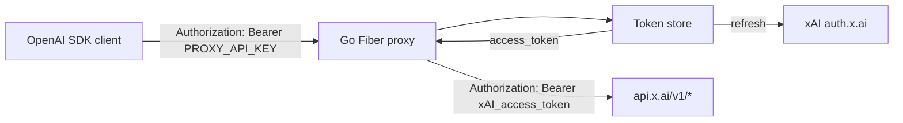

<div align="center">

# grok-oauth-api

**xAI Grok OpenAI-compatible OAuth proxy in Go**

[](https://go.dev)
[](LICENSE)
[](internal)

Use xAI Grok with any OpenAI-compatible client, without managing API keys manually.

</div>

## What is this?

`grok-oauth-api` is a lightweight Go proxy that sits between your OpenAI-compatible
applications and xAI's Grok API. It handles xAI's OAuth login flow for you, keeps
the access token fresh, and forwards your requests to `https://api.x.ai/v1` with
the correct bearer token.

No more copying tokens around. Log in once with the CLI, then point your client
at `http://localhost:8080/v1`.

## Features

- **OpenAI-compatible passthrough** — works with the OpenAI Python/JS SDKs, curl,
  or any client that speaks `/v1/chat/completions`.
- **One-command browser login** — `./grok-oauth-api oauth` opens your browser,
  waits for the redirect, and saves tokens.
- **Automatic token refresh** — refreshes before expiry with single-flight
deduplication so concurrent requests don't burn through refresh tokens.
- **Device-code flow** — for headless servers, SSH, Docker, or anywhere a browser
  redirect can't reach localhost.
- **JWT `exp` check** — double-checks token expiry in addition to the stored
  deadline.
- **Persistent storage** — tokens are saved to `auth.json` (ignored by git).

## Quick start

```bash
# 1. Clone and build
git clone https://github.com/yourusername/grok-oauth-api.git
cd grok-oauth-api
go build -o grok-oauth-api .

# 2. Log in with your xAI/SuperGrok account
./grok-oauth-api oauth

# 3. Start the proxy
PROXY_API_KEY=your-proxy-key ./grok-oauth-api start
```

Now use it like OpenAI:

```bash
curl http://localhost:8080/v1/chat/completions \
  -H "Authorization: Bearer your-proxy-key" \
  -H "Content-Type: application/json" \
  -d '{"model":"grok-3-latest","messages":[{"role":"user","content":"Hello"}]}'
```

## CLI commands

| Command | Description |
|---------|-------------|
| `./grok-oauth-api oauth` | Open your browser, complete OAuth, save tokens |
| `./grok-oauth-api start` | Start the proxy server |
| `./grok-oauth-api status` | Show saved token status |
| `./grok-oauth-api help`  | Show usage help |

```bash
# Check token status
./grok-oauth-api status

# Run directly without building
PROXY_API_KEY=your-proxy-key go run . start
```

## Configuration

Set via environment variables:

| Variable | Default | Description |
|----------|---------|-------------|
| `PORT` | `8080` | Proxy listen port |
| `PROXY_API_KEY` | `local-dev-key` | API key clients must present |
| `XAI_CLIENT_ID` | `b1a00492-073a-47ea-816f-4c329264a828` | xAI Grok-CLI OAuth client ID |
| `XAI_AUTHORIZE_URL` | `https://auth.x.ai/oauth2/authorize` | Authorization endpoint |
| `XAI_TOKEN_URL` | `https://auth.x.ai/oauth2/token` | Token endpoint |
| `XAI_DEVICE_URL` | `https://auth.x.ai/oauth2/device/code` | Device-code endpoint |
| `XAI_API_BASE` | `https://api.x.ai` | Upstream API base URL |
| `TOKEN_PATH` | `./auth.json` | Where tokens are persisted |
| `USER_AGENT` | `grok-oauth-proxy/0.1.0` | User-Agent for upstream requests |

## Usage with the OpenAI SDK

### Python

```python
from openai import OpenAI

client = OpenAI(
    base_url="http://localhost:8080/v1",
    api_key="your-proxy-key",
)

response = client.chat.completions.create(
    model="grok-3-latest",
    messages=[{"role": "user", "content": "Hello, Grok!"}],
)
print(response.choices[0].message.content)
```

### Node.js

```typescript
import OpenAI from "openai";

const client = new OpenAI({
  baseURL: "http://localhost:8080/v1",
  apiKey: "your-proxy-key",
});

const response = await client.chat.completions.create({
  model: "grok-3-latest",
  messages: [{ role: "user", content: "Hello, Grok!" }],
});
console.log(response.choices[0].message.content);
```

## Authentication methods

### Browser loopback flow (recommended for desktop)

```bash
./grok-oauth-api oauth
```

1. Starts a local callback server on `127.0.0.1:56121`.
2. Opens the xAI authorization URL in your default browser.
3. Waits for you to log in.
4. Exchanges the code, saves tokens to `auth.json`, and shows a success page.

### Device-code flow (recommended for headless / VPS / Docker)

For machines where `127.0.0.1:56121` is not reachable from your browser.

```bash
# 1. Request a device code
curl -X POST http://localhost:8080/oauth/device

# 2. Open the returned verification_uri on any device and enter user_code

# 3. Poll until complete
curl -X POST http://localhost:8080/oauth/device/poll \
  -H "Content-Type: application/json" \
  -d '{"device_code":"..."}'
```

## How it works



1. Client sends an OpenAI-formatted request to the proxy with `PROXY_API_KEY`.
2. Proxy validates the key and asks the token store for a valid access token.
3. If the token is expired or close to expiry, the store refreshes it once
   (single-flight) and persists the new pair.
4. Proxy forwards the request to xAI with the fresh bearer token.
5. Response is streamed back unchanged so SSE streaming works.

## Project structure

```
.
├── main.go                         # Entry point
├── cmd/grok-oauth-api/main.go      # CLI commands (oauth, start, status)
├── internal/
│   ├── config/config.go            # Environment configuration
│   ├── oauth/xai.go                # xAI OAuth implementation
│   ├── oauth/browser.go            # Cross-platform browser opener
│   ├── store/store.go              # Token persistence and refresh
│   ├── proxy/proxy.go              # OpenAI-compatible forwarding
│   └── server/routes.go            # HTTP routes
```

## Running tests

```bash
go test ./...
```

## License

MIT
